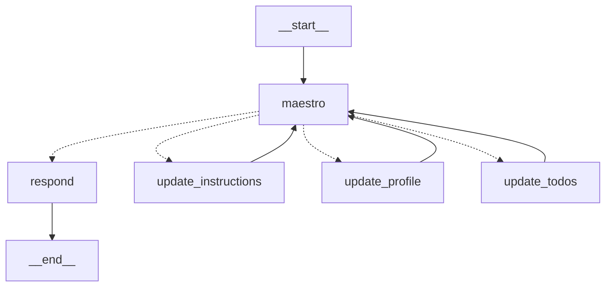

```mermaid
graph TD;
	__start__ --> maestro;
	maestro -.-> respond;
	maestro -.-> update_instructions;
	maestro -.-> update_profile;
	maestro -.-> update_todos;
	update_instructions --> maestro;
	update_profile --> maestro;
	update_todos --> maestro;
	respond --> __end__;

```